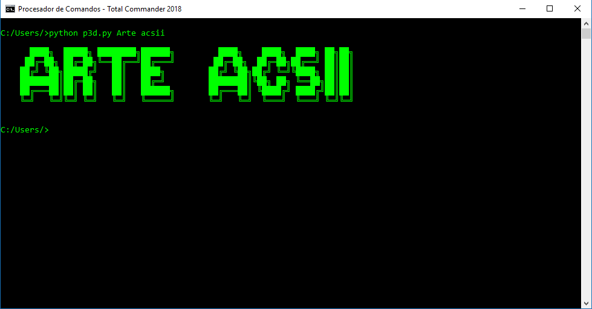
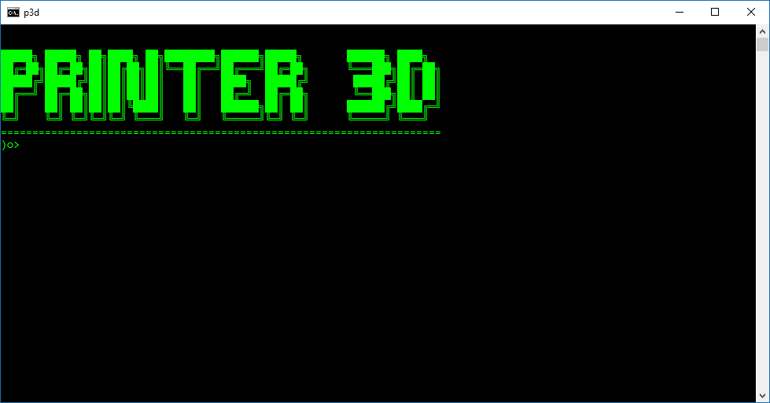

# 
**&Colon;&Colon;&Colon;&Colon;Printer-3D&Colon;&Colon;&Colon;&Colon;**

Imprime texto tipo 3D usando arte ASCII

Es util para ahorrarnos tiempo debujando letras clasicas,
aunque aún no se inclullen números o simbolos.Puedes mantenerlo
actualizado desde [GitHub](http:\\github.com\TexelHack\printer-3D)

## 
Ejemplo&colon;

# 
Codigo

**Desde la consola**
--------
---
*Directo*
> C:\User\Admin\\>p3d [Texto]    

Esto imprime el texto escrito de manera directa

*Indirecto*
> C:\User\Admin\\>p3d 

Es mas sensillo si no estas muy acostumbrado al uso
de la consola y se puede optener mejor resultado

**Desde Python**
--------
---

> \>>> from p3d import p3d  
> \>>> p3d('Texto')

Desde python lo puedes usar importando la función
 *p3d* para usarlo tus propios scripts

# 
Defectos

- La letra **Q** aún no existe (En solución)
- No se han hecho aún los números (En solución)
# 
***Licencia***

The MIT License (MIT)

Copyright (c) 2020 TexelHack

Permission is hereby granted, free of charge, to any person obtaining a copy
of this software and associated documentation files (the "Software"), to deal
in the Software without restriction, including without limitation the rights
to use, copy, modify, merge, publish, distribute, sublicense, and/or sell
copies of the Software, and to permit persons to whom the Software is
furnished to do so, subject to the following conditions:

The above copyright notice and this permission notice shall be included in all
copies or substantial portions of the Software.

THE SOFTWARE IS PROVIDED "AS IS", WITHOUT WARRANTY OF ANY KIND, EXPRESS OR
IMPLIED, INCLUDING BUT NOT LIMITED TO THE WARRANTIES OF MERCHANTABILITY,
FITNESS FOR A PARTICULAR PURPOSE AND NONINFRINGEMENT. IN NO EVENT SHALL THE
AUTHORS OR COPYRIGHT HOLDERS BE LIABLE FOR ANY CLAIM, DAMAGES OR OTHER
LIABILITY, WHETHER IN AN ACTION OF CONTRACT, TORT OR OTHERWISE, ARISING FROM,
OUT OF OR IN CONNECTION WITH THE SOFTWARE OR THE USE OR OTHER DEALINGS IN THE
SOFTWARE.